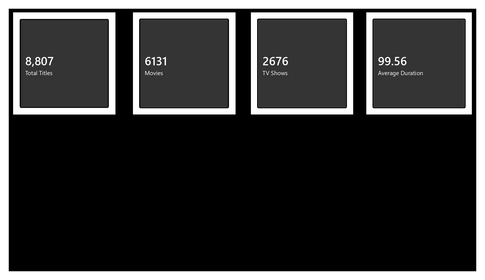
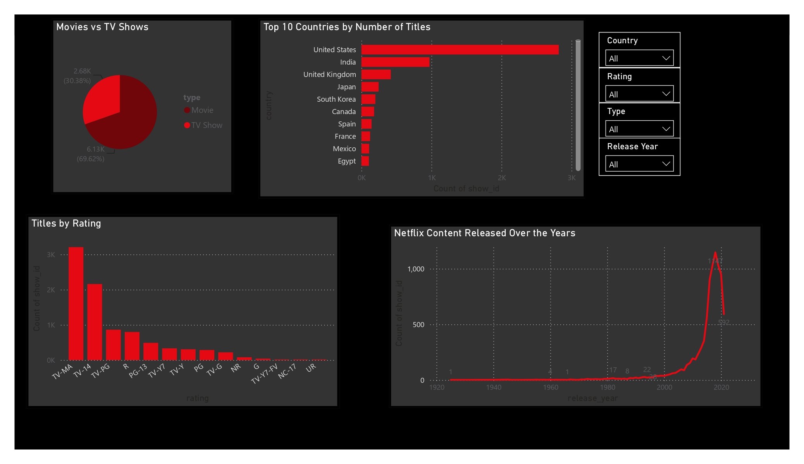
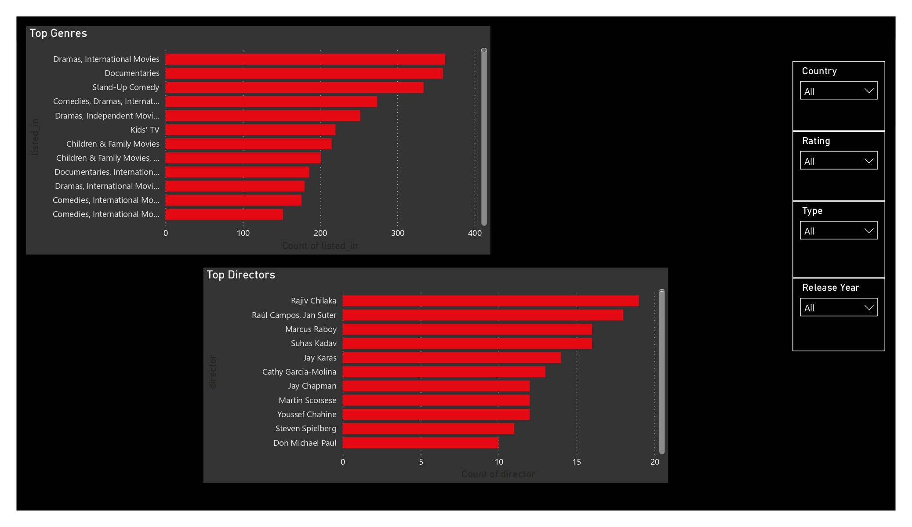

# Netflix Content Analysis

## Project Overview

-	This project analyses the Netflix content catalog using Excel, SQL, Python, and Power BI to uncover trends in movies and TV shows, content ratings, countries, genres, directors, and release years.
-	The project demonstrates the complete Data Analytics workflow, including data cleaning, SQL analysis, exploratory data analysis (EDA), and interactive dashboard creation.
---

## Tools Used

- Excel (Data Cleaning, Pivot Tables, Analysis)
- SQL (Data Analysis Queries)
- Python (Advanced Data Cleaning, Data Exploration and Visualization)
- Power BI (Interactive Dashboard)

---

## Dataset

-	Source: Netflix Movies and TV Shows Dataset
-	Total Records: 8,807
-	Features: 12 columns
Main columns include:
-	Show ID
-	Type
-	Title
-	Director
-	Cast
-	Country
-	Date Added
-	Release Year
-	Rating
-	Duration
-	Listed In (Genre)
-	Description		

---

## Project Workflow
### Phase 1 – Data Exploration & Analysis (Excel)
-	Started by exploring the raw Netflix dataset in Microsoft Excel.
-	Data Cleaning
-	Inspected dataset structure and column quality.
-	Checked for duplicate records.
-	Identified missing values.
-	Standardized basic formatting.
-	Performed initial cleaning where possible.

-	Exploratory Analysis using PivotTables
-	Used Excel PivotTables to perform initial business analysis, including:
-	Movies vs TV Shows
-	Top 10 Countries
-	Content Rating Distribution
-	Release Year Analysis
-	These PivotTables helped validate the data before moving to advanced analysis.
-	Challenges Identified
-	CSV encoding issues caused some movie titles to display incorrectly.
-	Excel automatically converted text values (for example, "15 August") into dates.
-	Multiple countries were stored in a single cell.
-	Missing values appeared as blanks or "Unknown".
-	Some data quality issues could not be resolved in Excel alone.
### Phase 2 – Advanced Data Cleaning (Python)
-	Since Excel could not resolve all issues, Python (Pandas) was used for advanced data cleaning before loading the data into SQL.
-	Tasks performed:
-	Cleaned missing values.
-	Standardized text formatting.
-	Removed duplicate records.
-	Corrected encoding issues.
-	Preserved text values that Excel automatically converted.
-	Exported a clean dataset (Netflix_SQL.csv) for SQL analysis.
-	Created a reusable cleaned dataset for Power BI.

### Phase 3 – SQL Analysis
-	Imported the cleaned dataset into MySQL and performed business analysis.
-	Analysis included:
-	Movies vs TV Shows
-	Top 10 Countries
-	Content Rating Distribution
-	Release Year Analysis
-	Top Directors
-	Longest Movie
-	Movies Released After 2020

-	SQL concepts used:
-	SELECT
-	WHERE
-	GROUP BY
-	ORDER BY
-	COUNT()
-	Aggregate Functions
________________________________________
### Phase 4 – Python Exploratory Data Analysis (EDA)
-	Used the cleaned dataset for Exploratory Data Analysis (EDA).
-	Performed:
-	Dataset exploration
-	Missing value analysis
-	Movies vs TV Shows
-	Top Countries
-	Rating Distribution
-	Release Year Trend
-	Top Genres
-	Top Directors
-	Duration Analysis

-	Libraries used:
-	Pandas
-	Matplotlib
### Phase 5 – Power BI Dashboard
-	Designed an interactive dashboard consisting of:
-	Executive Overview
- KPIs
-	Total Titles
-	Movies
-	TV Shows
-	Average Duration
-	Movies vs TV Shows

-	Content Analysis

-	Visualizations
-	 Movies vs TV Shows
-	Top Countries
-	Release Year Trend
-	Content Rating Distribution
-	Top Genres
-	Genre & Director Insights

-	Visualizations
-	Top Genres
-	Top Directors
-	Country
-	Interactive slicers
-	Country
-	Rating
-	Release Year
-	Content Type

## Dashboard Preview

________________________________________
⚠️ Challenges Faced During the Project
Working with real-world datasets involved several practical challenges:
-	Excel automatically converted text values such as "15 August" into dates.
-	CSV encoding issues caused some movie titles to appear as unreadable characters.
-	The MySQL Import Wizard initially imported only a small number of records instead of the full dataset.
-	Text columns containing commas and special characters required additional cleaning before SQL import.
-	Missing values and inconsistent country information affected analysis.
-	Duration values contained both minutes and seasons, requiring transformation before calculating averages in Power BI.
-	Power BI required additional DAX measures and calculated columns for KPI creation and dashboard metrics.
These challenges were resolved using a combination of Excel, Python, SQL, and Power BI, closely reflecting a real-world data analytics workflow.

